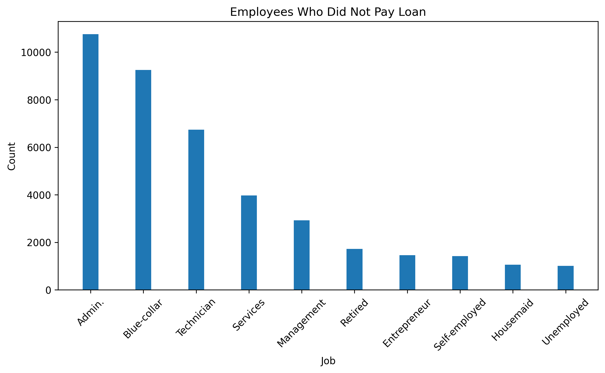
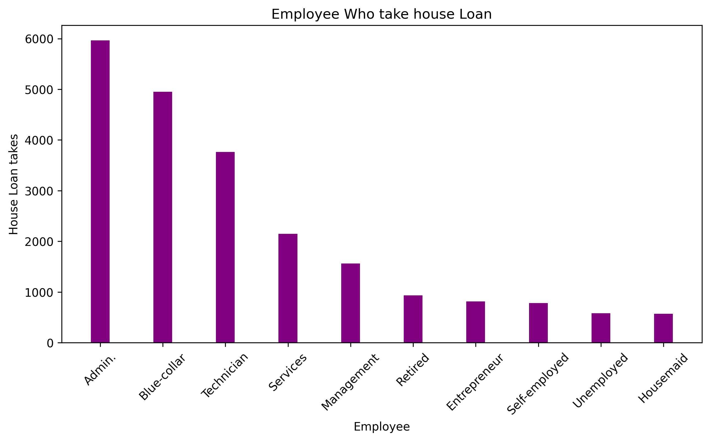
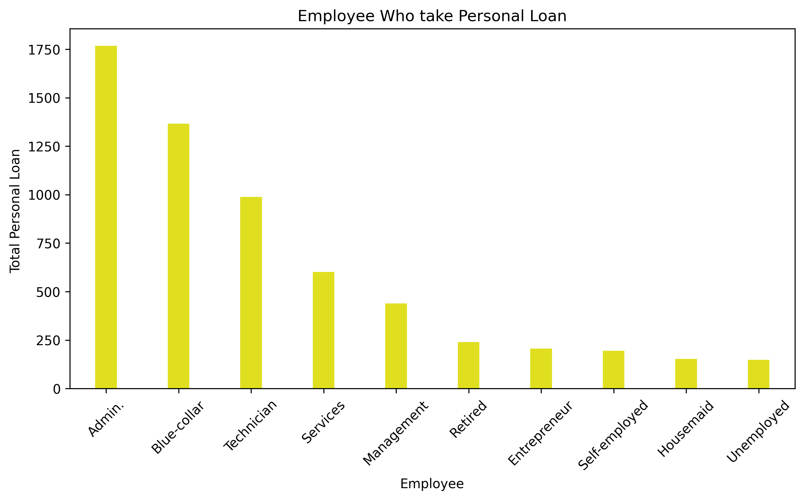
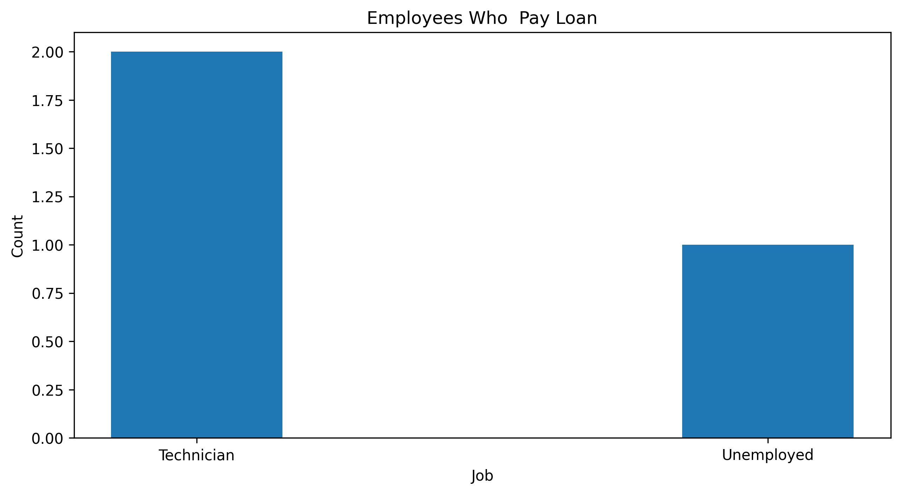
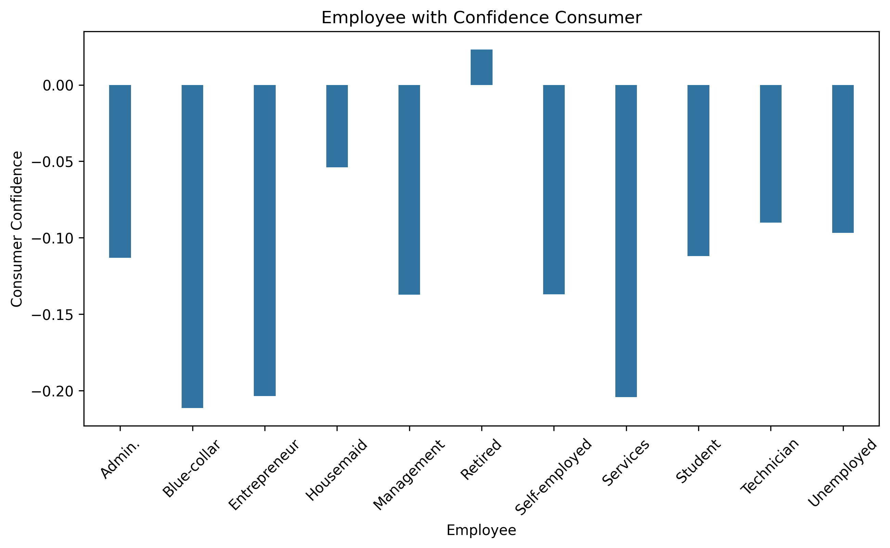
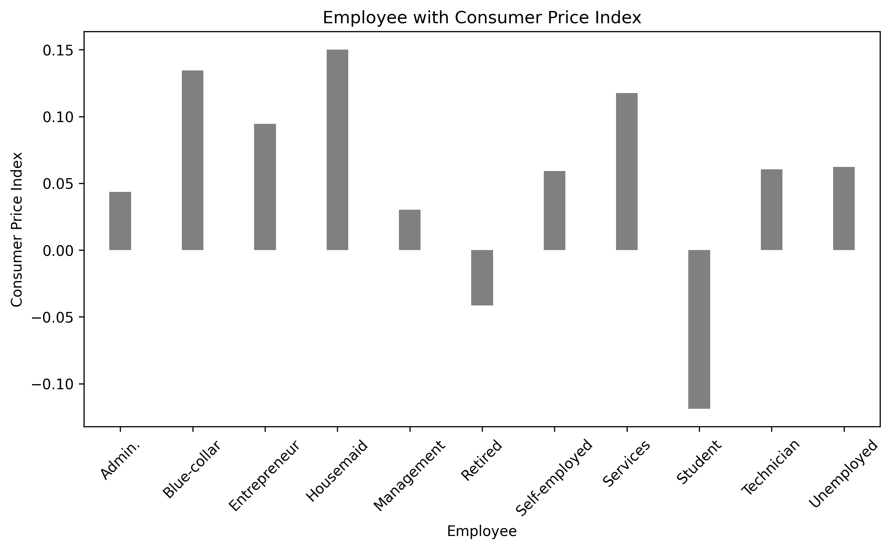
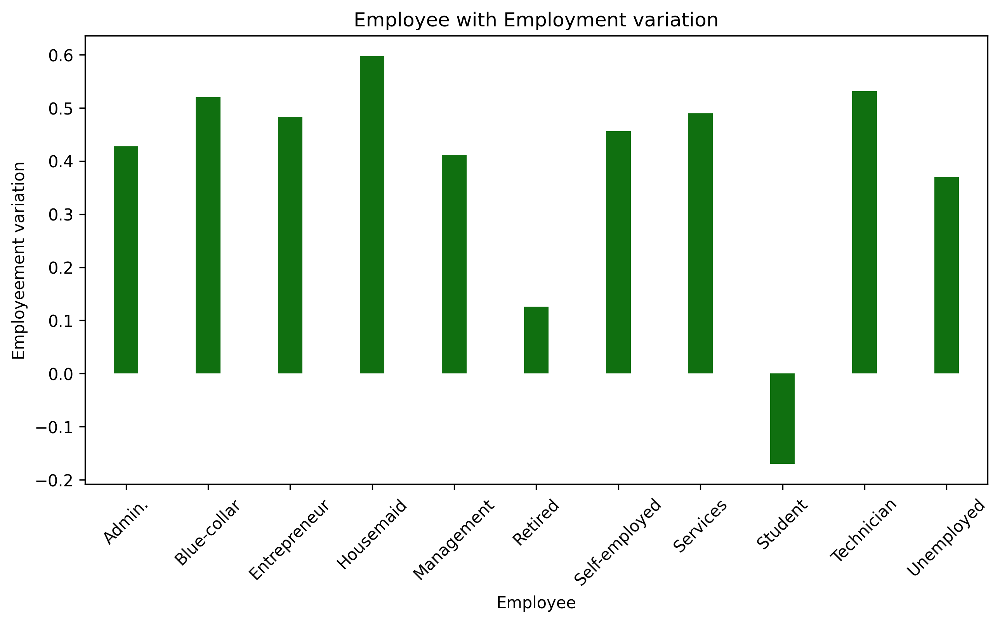

📌 Project Title: Bank Marketing Data Cleaning & Exploratory Data Analysis (EDA)

📂 Description:
This project focuses on cleaning, preprocessing, and visualizing the Bank Marketing Dataset to discover customer behavior patterns related to term deposits, personal loans, housing loans, and credit defaults.

✅ Key Steps Performed:

Data Cleaning & Preprocessing

Converted all categorical values to lowercase and removed unwanted spaces.

Replaced 'unknown' values with mode values in categorical columns.

Renamed columns to readable names (e.g., emp.var.rate → Employment variation, cons.price.idx → Consumer Price Index).

Encoded target variables like loan, housing, default, and Target using LabelEncoder().

Normalized features (CPI, Consumer Confidence, Employment Variation) to a range of -1 to 1.

Exploratory Data Analysis (EDA)

Visualized customer loan behavior using bar plots, histograms, and count plots.

Identified top job roles applying for personal loans or failing to repay loans.

Analyzed correlation between employment rate, CPI, interest rate, and subscription to term deposits.

Used Matplotlib and Seaborn for customized high-quality visuals.

Technologies Used:

Python, Pandas, NumPy

Matplotlib, Seaborn

Scikit-learn (Label Encoding, Normalization)

📊 Insights:

Jobs like admin, blue-collar, and technician show higher personal loan applications.

Default on loans is more common in specific job categories.

Economic indicators like Employment Variation & Consumer Confidence impact subscription decisions.

